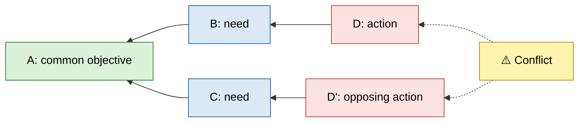

# Cloud Structure
Five entities, five arrows; in the diagram, a Conflict node stands in for the D–D' arrow. Every other arrow is a necessary-condition link: the entity on the right is needed for the entity on the left.

## The Entities
| Entity | What it is | Question that finds it | Test |
| --- | --- | --- | --- |
| **D** | The action the initiator feels pressure to take | "What is the pressure to do?" | A concrete action or want, something someone could do tomorrow. |
| **D'** | The opposing action | "What is the pressure to do instead?" | Cannot be done alongside D as currently framed. Often, but not always, the literal opposite. |
| **B** | The need D satisfies | "What does doing D get? What would be lost without it?" | A condition, not an action. D should be one way of meeting it, not the only conceivable way. |
| **C** | The need D' satisfies | "What does D' protect or achieve?" | Same as B. Written so the other party would recognise it as fair. |
| **A** | The common objective | "What do B and C both serve?" | Both parties would sign it. Broad enough to need B and C, specific enough to exclude neither. |

B and C are not in conflict; both are legitimate. Only D and D' clash. If B and C seem to clash, one of them is still a position, not a need.

## Reading the Cloud
Each side reads left to right, from the objective:

> In order to have **[A]**, we must have **[B]**. In order to have **[B]**, we must **[D]**.

> In order to have **[A]**, we must have **[C]**. In order to have **[C]**, we must **[D']**.

The conflict arrow:

> On one hand, **[D]**. On the other hand, **[D']**.

An initiator reads the other party's side first. That acknowledges the other need before stating their own, and gives the other party the chance to correct C or D'. A mediator reads both sides in either order but asks each party to confirm their own.

A reading that sounds forced ("in order to hire well, we must skip the procedure") is a signal: either the entity is mis-stated or an assumption is already visible. Both are worth pausing on.

## Drawing the Cloud
Use a Mermaid flowchart laid out right to left, so A sits on the left as in Goldratt's convention:

- **Conflict node, not a D–D' link.** Mermaid places the two ends of any link in different columns, so a direct link pulls D and D' apart. A separate node pointing at both keeps them stacked one above the other.
- **Warning icon as an emoji.** ⚠️ renders in GitHub, Obsidian and mermaid.live; Font Awesome `fa:` icons only render where the host loads Font Awesome.
- **One colour per role.** A green, B and C blue, D and D' red, Conflict yellow. Pairs share a colour so neither side looks like the wrong one; recolour a pair by editing its `classDef`.

Keep entity text short enough to read in the box; the full wording lives in the readings. Add the assumptions as a list under the diagram, grouped by arrow (A–B, A–C, B–D, C–D', D–D'), not as nodes.

## Worked Shapes
Illustrative clouds, not templates.

### Software Release
- **A:** Customers get software they can rely on.
- **B:** Releases are stable.
- **C:** Customer feedback arrives while it can still shape the product.
- **D:** Hold the release until the full regression suite passes.
- **D':** Release this week.

The B–D reading exposes a candidate assumption straight away: "the full regression suite is the only way to know a release is stable".

### Personal Budget
- **A:** A life enjoyed within the household's means.
- **B:** Something to look forward to that breaks the routine.
- **C:** Pleasure and connection in ordinary weeks, not only on holiday.
- **D:** Save every spare dollar for the trip.
- **D':** Eat out every week.

The C–D' reading exposes a candidate assumption: "only a restaurant meal makes an ordinary week feel like a treat".
